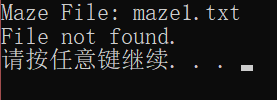
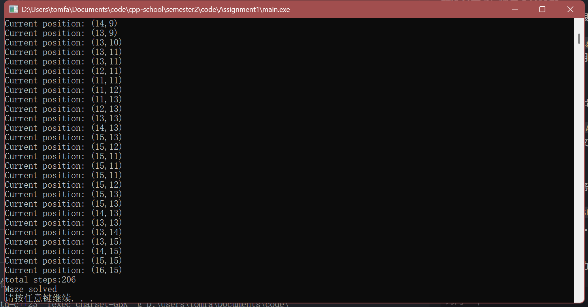
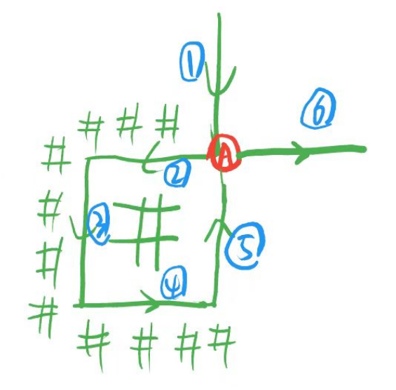
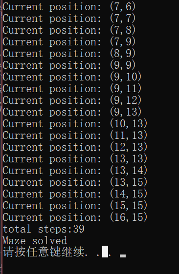
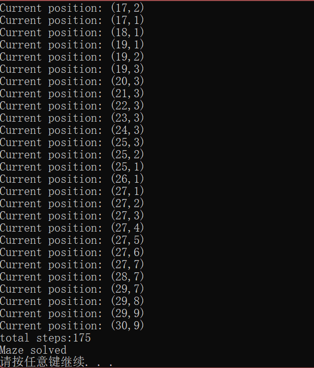

# 第一次实验报告

<small>**因为 markdown 的简洁和优美，并且有代码渲染功能，_并且在 vscode 里面可以边写代码边写报告很爽（？）_，这几份报告都是用 markdown 书写的，相关源文件已全部上传至[github](https://github.com/mingqian-233/cpp-school/)。**</small>

## 概览

任务要求我们修改给定的程序来走迷宫。乍一眼看是经典 dfs 入门题，但是题目特别限定了“摸右墙”走法。<small>~~仍然是经典的搜索入门题。~~</small>

> “摸右墙”走法：
> 优先考虑向右转并且向前走一步。
> 如果不能，则向前走一步。
> 如果仍然不能，则向左转。

用 <span style="font-weight:bold;color:red"> # </span> 表示墙壁，<span style="font-weight:bold;color:red"> .（或者除#之外的所有字符） </span> 表示通道。
迷宫入口默认在第一行唯一的 **.**，出口默认在最后一行唯一的 **.** 。
另外增加难度的设定是：读入用的是指针式的字符数组。不过这个是小问题。

## 实验过程

### 步骤 1

> 修改 Maze.cpp 中的四个函数让它们能跑。用 maze1.txt 测试。

看一眼 Maze.cpp 的代码。
看下题面要完成的四个函数分别是右转（仅修改方向），直走，<span style="color:red">WheresAhead（没看懂这是在干什么）</span>，左转（仅修改方向）。
看不懂就联系上下文。
WheresAhead 长这个样子：

```cpp
void WheresAhead(int pos, Direction heading, int& ahead) {
    // to be finished.
}
```

它是一个 void 函数，但是看函数名是查询的功能，那它的功能必定和引用传参的**ahead**有关系。
SolveMaze 函数中有一个这样的片段。

```cpp
        WheresRight(pos, heading, other);
        if (!Wall(other)) {
            TurnRight(heading);
            MoveForward(pos, heading);
        } else {
            WheresAhead(pos, heading, other);
            if (!Wall(other))
                MoveForward(pos, heading);
            else
                TurnLeft(heading);
        }
```

所以我们知道了这个 WheresAhead 修改的是 other，但是这个东西也做了防御性编程让我们看不懂。联系`if (!Wall(other))`这行代码，猜测到 pos 是当前位置，other 是下一个位置。联系题目，划分层次如下：

```cpp
        WheresRight(pos, heading, other);//得到右转向前走一步的位置
        if (!Wall(other)) {//如果这个位置不是墙壁
            TurnRight(heading);
            MoveForward(pos, heading);
            //走
        }

        else {//走不了
            WheresAhead(pos, heading, other);//得到向前走一步的位置
            if (!Wall(other))//如果能走就向前走
                MoveForward(pos, heading);
            else//不能走，就向左转？
                TurnLeft(heading);
        }
```

联系 WheresRight 的功能，WheresAhead 就很显然了。
但还感觉这个代码有点奇怪：右转部分明明有 MoveForward，左转部分忽然就没有了。但是回头看题目：
_turn right and **go forward one step**. Otherwise, go forward if possible, else **turn left**._
好吧，是题目奇怪。

回头看定义。方向的定义用了很工整的 enum，从 0 到 3 对应的分别是*下，左，上，右*。用手指比划一下可以注意到：把它看成一个循环数组，右转就是`new_dir=(dir+1)%4`，左转就是`new_dir=(dir-1+4)%4`。这个实现简直太简单啦！

```cpp
void TurnRight(Direction& heading) {
    heading = (Direction)(heading + 1) % 4;
}
```

然后程序就尬住了。报错信息：

```
不能将 "int" 类型的值分配到 "Direction" 类型的实体
```

哈哈，好像不能这样用（尬笑），这说明我们上学期的知识掌握不牢。查一下笔记，发现这里要用 `static_cast`显式转换（强制类型转换）为枚举类型。
TurnLeft 的实现同理。

```cpp
void TurnRight(Direction& heading) {
    heading = static_cast<Direction>((heading + 1) % 4);
}

void TurnLeft(Direction& heading) {
    heading = static_cast<Direction>((heading + 3) % 4);
}

```

然后写 WheresAhead。发现 WheresRight 有现成的让我们用，那我们就不客气了。直接拿来改一下内容就好。
怎么改呢？容易想到：**向前一步的坐标={向左转后}{向右然后向前走一步的坐标}**。所以我们直接调用 TurnLeft 修改 heading（反正这里的 heading 没有引用），调用 WheresAhead 就好啦！~~代码复用率极高！~~

```cpp

void WheresAhead(int pos, Direction heading, int& ahead) {
    TurnLeft(heading);
    WheresRight(pos, heading, ahead);
}

```

然后就是 MoveForward。我们刚刚已经实现了 WheresAhead 函数了，那我们直接把 pos 赋值为 WheresAhead 的结果不就行了吗？

```cpp
void MoveForward(int& pos, Direction heading) {
    int newPos;
    WheresAhead(pos, heading, newPos);
    pos = newPos;
}
```

如上，步骤一我们就靠~~程序员本质的复制粘贴机特性~~高效复用代码完成了。

在 main.cpp 中运行，炸了。

```
/main.cpp:12:(.text+0x4d): undefined reference to `SolveMaze()'
collect2.exe: error: ld returned 1 exit status
```

一定是 vscode 害的！显然编译过程中编译器没有链接`maze.cpp`导致未定义。查了一下资料，咱平时用的编译插件是**C/C++ Compile Run**，它的说明书有这么一句话：

> An extension running on Visual Studio Code to Compile, Run & Debug **single** c/c++ files easily

这是个单文件编译插件啊！

我们直接用原生的 task 来编译运行。在`task.json`新增一个 build all tasks 任务，关键在于添加这么一行指令：

```json
"${fileDirname}/\*.cpp", // 编译与 main.cpp 同一目录下的所有 .cpp 文件
```

然后修改 launch.json，就可以进行多文件编译了。

……
经过检查，需要把 launch.json 的`"cwd": "${workspaceFolder}",`改为`"cwd": "${fileDirname}",`。


跑通了。

### 步骤 2

题目描述很长很绕，一点都不想看。
部分描述有点奇怪。特别是对于 _avoid putting a duplicate of the current position (we're turning around)_ 这句描述。上我们的灵魂画作：

这里从 ① 走到 ⑥ 完全遵守了“摸右墙”的原则，并且也没有走“回头路”。那这个 ②→⑤ 的中间路径要不要去掉呢？
杜卿老师解释说是走最短路，题目也隐含着要“去掉重复位置”的概念，那我们就理解为去掉所有重复位置就好。
最终总结题意：

> 修改程序，把输出的路径变成最短路径，不出现任何重复的坐标。

这个实现起来很简单。上一个 step 中我们发现了记录路径是静态处理的（即先把需要输出的内容写入数组，最后再输出）。那我们修改写入的过程就行。
输出数组为`posi`，用 map 记录坐标 x 上一次出现在`posi`处的下标，第二次出现的时候直接覆写即可。
_覆写的方法：想象 posi 是一个纸条，我们在上面从左往右写字。假如 2 前面出现了一次，我们这次又要写 2，就直接把笔放到上次的 2 的位置往下面写。_
简单修改走迷宫过程的代码，在`posi[i] = pos;`和`i++;`之间添加少量代码，如下：

```cpp
        posi[i] = pos;  // 静态记录位置

        if (mp.find(pos) == mp.end()) {
            mp[pos] = i;  // 没出现过这个位置
        } else {
            i = mp[pos];  // 出现过这个位置，直接跳到这个位置覆写
        }

        i++;
```


一次解决，好耶。

### 步骤 3

> 我们现在将修改程序以处理任意大小的迷宫。
> a) 修改迷宫的声明，使其成为一个指向字符的指针。
> b) 修改 LoadMaze()，以便动态分配迷宫的空间。
> c) 同时使路径数组动态分配为合适的大小。
> d) 在 SolveMaze() 的末尾删除所有分配的内存。
> 使用 maze3.txt 进行测试。

初始化改为`char* maze = NULL;`就行，同时 posi 也需要修改为指针数组。
迷宫的输入文件指定了 mazeWidth 和 mazeHeight，就在输入之后用 new 分配 maze 和 posi 的内存。
“使路径数组动态分配为合适的大小”，posi 最大不超过迷宫大小，如果懒一点的话直接分配一样多就行了。如果再往下就是出现一个可以走的位置就多分配一个，最小的就是每添加一个新位置才分配一个新内存（使用 realloc），但性能会超级慢。还不如用 vector。但题目不让。
那就用第二个想法。读入的时候出现一个能走的地方就计数+1，读入后重新给 posi 按照计数分配内存。
把 SolveMaze 所有限制数组大小的条件改成`i>=1e8`，在基本不限制数组大小的前提下防止炸内存。
最后在 SolveMaze 的结尾 delete 掉两个动态数组就行了。
运行结果看起来还行。

修改过的代码如下：

**LoadMaze 函数**

```cpp
char* maze = NULL;
int mazeWidth, mazeHeight;
int* posi = NULL;
int i = 0;
bool LoadMaze(const char fname[]) {
    ifstream ifs(fname);
    if (ifs.good()) {
        ifs >> mazeWidth >> mazeHeight;
        int count_able = 0;
        maze = new char[mazeWidth * mazeHeight];
        for (int i = 0; i < mazeHeight; i++)
            for (int j = 0; j < mazeWidth; j++) {
                ifs >> maze[i * mazeWidth + j];
                count_able += maze[i * mazeWidth + j] != '#';
            }
        posi = new int[count_able];
        ifs.close();
        return true;
    } else {
        cerr << "File not found." << endl;
        return false;
    }
}
```

**SolveMaze 函数**

```cpp
void SolveMaze() {
    int pos, other;
    Direction heading;

    FindEntrance(pos);
    heading = DOWN;
    map<int, int> mp;
    while (!AtExit(pos)) {
        posi[i] = pos;  // 静态记录位置
        if (mp.find(pos) == mp.end()) {
            mp[pos] = i;  // 没出现过这个位置
        } else {
            i = mp[pos];  // 出现过这个位置，直接跳到这个位置覆写
        }
        i++;
        if (i >= 1e8) {  // 判断是否超出数组17*17，任务三要修改这个289
            cout << "array too small\n";
            abort();
        }
        WheresRight(pos, heading, other);
        if (!Wall(other)) {
            TurnRight(heading);
            MoveForward(pos, heading);
        } else {
            WheresAhead(pos, heading, other);
            if (!Wall(other))
                MoveForward(pos, heading);
            else
                TurnLeft(heading);
        }
    }
    posi[i] = pos;
    i++;
    if (i >= 1e8) {
        cout << "array too small\n";
        abort();
    }
    int counter = 0;
    for (int j = 0; j < i; j++) {
        if (posi[j] < 0)
            continue;
        cout << "Current position: (" << posi[j] / mazeWidth << ',' << posi[j] % mazeWidth << ')' << endl;
        counter++;
    }
    cout << "total steps:" << counter << endl;
    cout << "Maze solved" << endl;
    delete[] maze;
    delete[] posi;
    maze = NULL;
    posi = NULL;
}

```

## 实验心得

虽然这次的实验目的好像是为了研究指针和动态内存分配的使用，但是感觉卡的最久的还是环境……虽然 Visual Studio 的一体化的环境让开发非常轻松，但是修改 VS Code 的配置的过程中才能真正感受到编译器从编译层面做的所有工作，接触到程序的“**本质**”，也就是杜卿老师和我们上学期说的<span style="color:red;font-weight:bold">软件工程专业和其他专业最大的不同</span>。

当然工具是一回事，并没有优劣之分，主要还是看人怎么去运用它。至少这次实验最大的收获是知道了我天天用的 Extension 不能处理多文件 XD.
