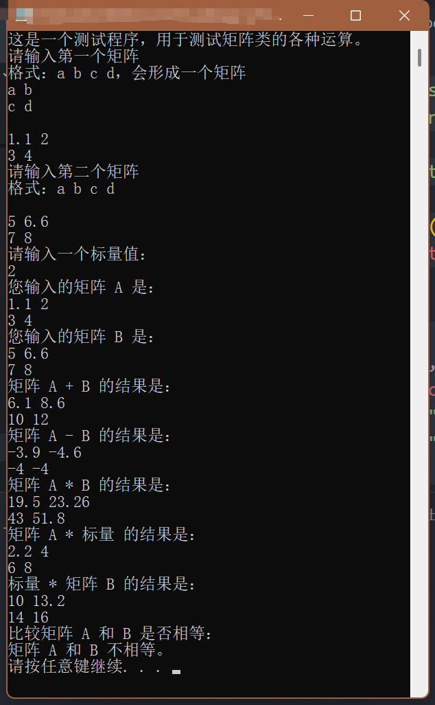

# 第二次实验报告

source code:[github](https://github.com/mingqian-233/cpp-school/)

## 题目分析

做一个矩阵计算器，通过重载运算符实现矩阵运算。
具体要求如下：

### 1. 创建一个 `Matrix` 类

- **文件存放**：将代码分别写入 `Matrix.cpp` 和 `Matrix.h` 文件。
- **功能**：该类用于表示 2×2 矩阵，矩阵形式为：
  \[
  \begin{bmatrix}
  a & b \\
  c & d \\
  \end{bmatrix}
  \]
  其中 \(a, b, c, d\) 是实数。

### 2. 初始化矩阵

- **默认初始化**：当创建矩阵对象时，矩阵应初始化为单位矩阵$I$，单位矩阵的形式为：
  \[
  \begin{bmatrix}
  1 & 0 \\
  0 & 1 \\
  \end{bmatrix}
  \]

### 3. 重载插入运算符（`<<`）

- **功能**：用于显示矩阵的内容。
- **输出格式**：矩阵的显示格式应符合特定要求
  ```
  [a b]
  [c d]
  ```

### 4. 重载提取运算符（`>>`）

- **功能**：用于从输入中读取四个实数来填充矩阵。
- **输入顺序**：输入的四个实数依次为 \(a, b, c, d\)，按顺序填充矩阵。

### 5. 重载二元运算符（`+`, `-`, `*`）

- **功能**：实现矩阵加法、减法和乘法。
- **返回值**：这些运算的结果都应是 2×2 矩阵。
- **链式操作**：运算符必须支持链式操作，例如 `A + B + C`。

### 6. 重载复合赋值运算符（`+=`, `-=`, `*=`）

- **功能**：作为类的成员函数，实现矩阵的加法、减法和乘法的复合赋值操作。

### 7. 重载乘法运算符（标量乘法）

- **功能**：实现矩阵与标量的乘法，即矩阵的每个元素乘以一个实数。

### 8. 重载比较运算符（`==`, `!=`）

- **功能**：用于比较两个矩阵是否相等或不相等。

### 9. 测试

- **测试文件**：使用 `MatrixMain.cpp` 中提供的 `main` 函数来测试你的 `Matrix` 类。

## 过程

### Matrix.h

首先写好.h 再实现。

#### 基本框架

```cpp
#ifndef MATRIX_H
#define MATRIX_H
#include <iostream>
#include <string>
class Matrix {
private:
    double data[2][2];

public:
    Matrix();
    ~Matrix();

};
#endif
```

这个壳是万年不变的。再往里面填充内容。

#### 插入与提取运算符

老师上课讲过，这俩运算符左边是流对象`std::i(o)stream`，得定义成友元函数。

```cpp
    friend std::ostream &operator<<(std::ostream &, const Matrix &);
    friend std::istream &operator>>(std::istream &, Matrix &);
```

老师让我们记住这些`const`和`&`是干嘛的。那就一个个解释：
`&operator`：要返回流对象的引用，不然链式操作会翻车
后面两个`&`：节省内存开支
输出的第二个参数：不可以加 `const`，不然无法修改它的内容。

#### 加减乘

前后的 `const` 分别保证不改变右操作数的值和左操作数的值。左操作数是`*this`，右操作数是传入的参数，`&`节省内存开销。

注意这一系列不可以写成 `Matrix&`。因为在函数内部要定义 res 之后返回，就等于返回一个被释放的局部引用。

```cpp
    Matrix operator+(const Matrix &) const;
    Matrix operator-(const Matrix &) const;
    Matrix operator*(const Matrix &) const;
    Matrix operator*(double) const;
    //左操作和右操作是double的情况要分别实现，其中做操作是实数的需要开一个友元
    friend Matrix operator*(double, const Matrix &);
```

_查阅资料发现，这里 `double` 不应当引用，因为对这些内置类型的参数值编译器会自己做优化，拷贝成本低，如果拷贝还得解引用指针，效率更低。_

#### 加减乘复合赋值

和刚刚一样，有两个小细节的区别：

1. `Matrix&`，为了能够链式操作（因为需要返回一个被引用的对象才可以链式操作）
2. `*this`当然需要修改，后面的 const 要去掉。

```cpp
    Matrix &operator*= (const Matrix &);
    Matrix &operator*= (double);
    Matrix &operator+=(const Matrix &);
    Matrix &operator-=(const Matrix &);
```

#### 比较符号

没什么特别的，就返回一个`bool`类型，不该修改的全部加`const`，能拷贝的都拷贝。

```cpp
    bool operator==(const Matrix &) const;
    bool operator!=(const Matrix &) const;
```

### Matrix.cpp

然后一个一个实现功能。
感觉超级繁琐，就是把一堆相似的功能一直复制粘贴然后改一下函数里面的运算。听说有一种叫 CRTP 的东西可以让这个写起来更方便，但是老师没讲。
实现基本没什么需要特别注意的，有一个容易搞错的地方：**矩阵被初始化为 I，但是矩阵乘法的时候需要一个 res 来储存，如果不给 res 赋值为 0 就会莫名其妙出来一个错误答案**。
后面的复合赋值部分，能复用代码就复用代码。

```cpp
#include "Matrix.h"

#include <iostream>

Matrix::Matrix() {
    data[0][0] = 1;
    data[0][1] = 0;
    data[1][0] = 0;
    data[1][1] = 1;
}

std::ostream &operator<<(std::ostream &os, const Matrix &m) {
    for (int i = 0; i <= 1; i++) {
        for (int j = 0; j <= 1; j++) {
            os << m.data[i][j] << " ";
        }
        os << '\n';
    }
    return os;
}
std::istream &operator>>(std::istream &is, Matrix &m) {
    for (int i = 0; i <= 1; i++) {
        for (int j = 0; j <= 1; j++) {
            is >> m.data[i][j];
        }
    }
    if (std::cin.fail()) {
        std::cerr << "呃，你输入的是啥啊？\n";
        system("pause");
        exit(1);
    }
    return is;
}

Matrix Matrix::operator+(const Matrix &m) const {
    Matrix res;
    for (int i = 0; i <= 1; i++) {
        for (int j = 0; j <= 1; j++) {
            res.data[i][j] = data[i][j] + m.data[i][j];
        }
    }
    return res;
};
Matrix Matrix::operator-(const Matrix &m) const {
    Matrix res;
    for (int i = 0; i <= 1; i++) {
        for (int j = 0; j <= 1; j++) {
            res.data[i][j] = data[i][j] - m.data[i][j];
        }
    }
    return res;
};
Matrix Matrix::operator*(const Matrix &m) const {
    Matrix res;
    for (int i = 0; i <= 1; i++) {
        for (int j = 0; j <= 1; j++) {
            res.data[i][j] = 0;
            for (int k = 0; k <= 1; k++) {
                res.data[i][j] += data[i][k] * m.data[k][j];
            }
        }
    }
    return res;
};
Matrix Matrix::operator*(double d) const {
    Matrix res;
    for (int i = 0; i <= 1; i++) {
        for (int j = 0; j <= 1; j++) {
            res.data[i][j] = data[i][j] * d;
        }
    }
    return res;
};
Matrix operator*(double d, const Matrix &m) {
    return m * d;
};

Matrix &Matrix::operator*=(const Matrix &m) {
    *this = *this * m;
    return *this;
};
Matrix &Matrix::operator*=(double d) {
    *this = *this * d;
    return *this;
};
Matrix &Matrix::operator+=(const Matrix &m) {
    *this = *this + m;
    return *this;
};
Matrix &Matrix::operator-=(const Matrix &m) {
    *this = *this - m;
    return *this;
};
bool Matrix::operator==(const Matrix &m) const {
    for (int i = 0; i <= 1; i++) {
        for (int j = 0; j <= 1; j++) {
            if (abs(data[i][j] - m.data[i][j]) > 1e-9) {
                return false;
            }
        }
    }
    return true;
};
bool Matrix::operator!=(const Matrix &m) const {
    return !(*this == m);
};

Matrix::~Matrix() {
#ifdef DEBUG
    std::cout << "Matrix destroyed" << std::endl;
#endif
}
```

### MatrixMain.cpp
简单写一写测试即可。
```cpp
#include <iostream>
#include <string>

#include "Matrix.h"

void message(const std::string &str) {
    std::cout << str << std::endl;
}

int main() {
    Matrix A, B, C;
    double scalar;
    message("这是一个测试程序，用于测试矩阵类的各种运算。");
    message("请输入第一个矩阵 \n格式：a b c d，会形成一个矩阵\na b\nc d\n");
    std::cin >> A;

    message("请输入第二个矩阵 \n格式：a b c d\n");
    std::cin >> B;

    message("请输入一个标量值：");
    std::cin >> scalar;

    message("您输入的矩阵 A 是：");
    std::cout << A;

    message("您输入的矩阵 B 是：");
    std::cout << B;

    message("矩阵 A + B 的结果是：");
    C = A + B;
    std::cout << C;

    message("矩阵 A - B 的结果是：");
    C = A - B;
    std::cout << C;

    message("矩阵 A * B 的结果是：");
    C = A * B;
    std::cout << C;

    message("矩阵 A * 标量 的结果是：");
    C = A * scalar;
    std::cout << C;

    message("标量 * 矩阵 B 的结果是：");
    C = scalar * B;
    std::cout << C;

    message("比较矩阵 A 和 B 是否相等：");
    if (A == B) {
        message("矩阵 A 和 B 相等。");
    } else {
        message("矩阵 A 和 B 不相等。");
    }
    system("pause");
    return 0;
}
```


看起来是对的。

对错误输入有相应的反应。
