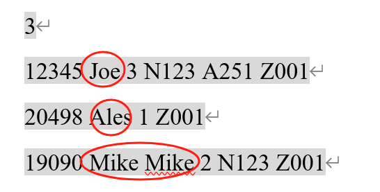
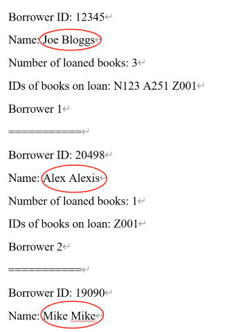
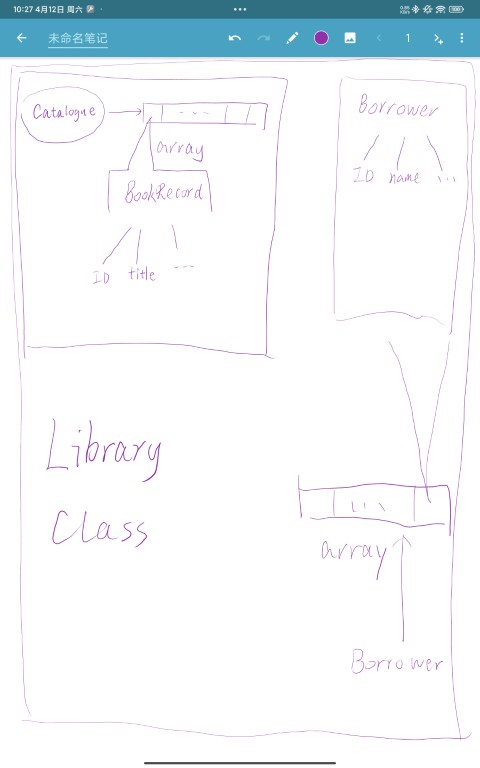

# 第三次实验报告

<sub><sub><sub>update: 修复了写得不像实验报告的 bug。</sub>

## 实验目的

该实验的目的是设计并实现一个图书馆管理系统，旨在通过面向对象编程的方式，掌握类的设计与实现、数据验证、文件与键盘输入处理、动态数组管理等编程技巧。具体目标包括：

1. **掌握类的设计与实现**：通过设计 Library、BookRecord、Borrower 和 Catalogue 类，理解类之间的关系及其职责划分。
2. **数据验证与错误处理**：学习如何验证输入数据的格式，并在数据不符合要求时进行错误处理。
3. **文件与键盘输入处理**：实现从文件或键盘读取数据的功能，掌握输入流的使用方法。
4. **动态数组管理**：通过使用动态容器（如 `std::vector`），解决数组大小不确定的问题。
5. **程序的模块化设计**：通过将功能划分到不同的类和文件中，提高代码的可读性和可维护性。
6. **综合运用 C++ 编程知识**：包括构造函数、析构函数、异常处理、标准库容器等。

通过完成本实验，学生将能够更好地理解面向对象编程的核心思想，并将其应用于实际问题的解决。

## 题目重现

该任务要求设计一个图书馆管理系统，通过三个文件（Library.cpp、Library.h 和 Main.cpp）实现以下功能：

1. **输入数据处理**：从键盘或文件读取书籍和借阅者数据，验证输入格式是否符合要求（如书籍 ID 以大写字母开头、借阅者 ID 为五位数字等），不符合的记录输出错误信息并跳过。

2. **类设计**：

   - **Library 类**：管理书籍和借阅者数据，包含书籍目录（Catalogue 对象）和借阅者数组，统计借出书籍总数和借阅者总数。
   - **BookRecord 类**：存储书籍信息（ID、标题、作者、出版年份、副本总数、可借副本数），验证输入格式。
   - **Borrower 类**：存储借阅者信息（ID、姓名、借阅书籍数、借阅书籍 ID 列表），验证 ID 格式。
   - **Catalogue 类**：维护书籍记录数组，统计书籍总数并显示书籍信息。

3. **功能实现**：

   - 初始化时读取书籍和借阅者数据，更新书籍借出状态。
   - 提供显示书籍和借阅者信息的函数。
   - 主函数（main）展示系统状态（借出书籍总数、书籍目录、借阅者列表）。

4. **附加要求**：程序不依赖用户输入，需提供类图（Diagram.pdf）。

## 分析题目

计算机行业有一个流行的“梗”：每个计算机大类的本科生的必经之路——图书管理系统。这个梗虽然带有调侃性质，但足以看出来图书管理系统对知识的综合应用的考察程度之深。而且这个任务实际上并不简单。所以在完成任务前，需要先仔细思考总体构建和类与类之间的关系，避免关系混乱冲突的问题出现。况且题目描述感觉逻辑上也有些混乱 **（完全没有按照逻辑顺序来呈现题意）**，并且存在一些<span style="color:red">fatal error</span> 。

例如，令人非常困惑不解的是，同样是对 BookRecord 输入的要求，却拆成了距离很远的两部分讲述，导致理解题目和实现增加了不必要的难度。


更加糟糕的是，题目并没有给出借阅者的姓名格式提示，而给出的示例，输入数据格式不一致，输入数据和输出数据冲突。类似地，题目中的书籍的作者也出了问题！



为了贴合题目，决定将书籍的作者和借阅者的姓名都限制为 First Name + Last Name 的格式。这样就可以避免输入错误了。需要对输入数据修正。如下图所示。


不论如何，需要先理清楚类与类之间的关系。可以从题目中提取出以下信息：


画图是最简单的整理思路的方法。这里省略大部分信息，保留最重要的部分，类之间的关系就很容易看清楚了。
因此，也确定了的工作流程：


## 困难、误区及分析、解决方案

在实现过程中，遇到了一些困难和误区。经过分析和讨论，提出了解决方案。具体如下：

### Array

题目要求中存在以下描述：

> 4. An array of Borrower objects (described below). This should be populated during initialization by the constructor.

这样的描述。但是在实现时发现，题目中并没有给出 Borrower 数组的大小。使用 array 容器是不可能的，使用指针数组也有缺陷（需要在析构函数中释放内存，实现复杂程度高）。因此虽然不确定 vector 实现是否被认为确实是用 array 解决了问题，但还是决定使用 vector 容器来存储 Borrower 等对象。vector 容器可以动态扩展大小，避免了数组大小不确定的问题。

### 输入数据

题目要求可以从键盘或文件读取书籍和借阅者数据，所以代码提供了两种输入方式。一开始时，使用 if 分开两个分支处理，但是这样会导致代码重复，且不易维护。
因此将公共逻辑提取成通用函数。指定 inputStream 指针，如果是键盘输入，则指向 cin；如果是文件输入，则指向 ifstream 对象。这样就可以通过同一个函数处理两种输入方式。

```cpp
    if (choice == 1) {
        // 从文件读取
        std::cout << "Read data from file. Please enter the book file name:\n";
        std::string bookFileName;
        std::cin >> bookFileName;
        fileStream.open(bookFileName);
        if (!fileStream.is_open()) {
            throw std::runtime_error("Error: Unable to open book file.");
        }
        inputStream = &fileStream;  // 指向文件流
    } else if (choice == 2) {
        // 从键盘读取
        std::cout << "Read data from keyboard. Please enter the number of books:\n";
        inputStream = &std::cin;  // 指向标准输入流
    } else {
        throw std::invalid_argument("Invalid choice for input method.");
    }
```

另外将输入数据的验证逻辑也提取成了一个函数（因为要大量输入数字）。

```cpp
void handleInputError(std::istream& inputStream, const std::string& errorMessage) {
    if (inputStream.fail()) {
        inputStream.clear();
        inputStream.ignore(std::numeric_limits<std::streamsize>::max(), '\n');
        throw std::invalid_argument(errorMessage);
    }
}
```

然而当仔细看题目的时候，发现：

> <span style="color:red;">Besides the two input data, the program should not depend on any input from the user when it runs.</span>

虽然这说明上面的工作有一半是无效的，但至少程序提供了多样化的接口，在重用性上也有很大的提升。
修改也很容易，不要读入 choice，默认 choice=1，并且不读入文件名，默认文件名为 `book.txt`。这样就可以满足题目的要求了。

### 输出数据

受到示例的启发，认为输出数据也应该使用函数，这样可以避免重复代码，能够大量重用。并且还使用了*函数重载*来实现不同类型的输出函数。这样可以根据需要选择不同的输出方式。

```cpp
void outputKeyValue(const std::string& key, const std::string& value) {
    std::cout << key << ": " << value << std::endl;
}
void outputKeyValue(const std::string& key, const std::vector<std::string>& value) {
    std::cout << key << ": ";
    for (const auto& v : value) {
        std::cout << v << " ";
    }
    std::cout << std::endl;
}
void outputKeyValue(const std::string& key, int value) {
    std::cout << key << ": " << value << std::endl;
}
```

### 参数的更新
本题的参数非常多，层层相扣。所以更新的时候需要格外小心。
在输入借阅者的时候，实际上应该同时更新 library 中两个参数：借阅者计数和被借阅书籍计数。在实现的时候没有考虑到这个问题。导致在输出的时候，borrowedBooksCount 的值不正确，调试的时候花费了较多时间。参数的更新如下：

```cpp
        totalBorrowers++;
        totalBorrowedBooks += borrowedBooksCount;
```

## 实验

输入数据如下：

```txt
3
N123 Object-Oriented-Programming Dave Smith 2009 3
A251 UML-Modelling-and-Design Barry Arthurs 2005 1
Z001 Practical-Guide-to-STL John Johnson 2000 5
3
12345 Joe Bloggs 3 N123 A251 Z001
20498 Alex Alexis 1 Z001
19090 Mike Mike 2 N123 Z001
```

输出数据如下：

```txt
Welcome to the Library Management System!
Read data from file.
Total number of books on loan: 6
Total number of books in the catalogue: 3
Book 0:
-------------------------
Book ID: N123
Book Title: Object-Oriented-Programming
Author: Dave Smith
Year Published: 2009
Total number of Copies: 3
Number available for loan: 3
Book 1:
-------------------------
Book ID: A251
Book Title: UML-Modelling-and-Design
Author: Barry Arthurs
Year Published: 2005
Total number of Copies: 1
Number available for loan: 1
Book 2:
-------------------------
Book ID: Z001
Book Title: Practical-Guide-to-STL
Author: John Johnson
Year Published: 2000
Total number of Copies: 5
Number available for loan: 5
Borrower 0:
-------------------------
Borrower ID: 12345
Name: Joe Bloggs
Number of loaned books: 3
IDs of books on loan: N123 A251 Z001
Borrower 1:
-------------------------
Borrower ID: 20498
Name: Alex Alexis
Number of loaned books: 1
IDs of books on loan: Z001
Borrower 2:
-------------------------
Borrower ID: 19090
Name: Mike Mike
Number of loaned books: 2
IDs of books on loan: N123 Z001
-------------------------
End of the Library Management System
```


如图所示，程序运行情况良好。

另外，制造异常数据，检验程序的鲁棒性。输入数据如下：

1. 修改年份为 20003，输出：

```txt
Welcome to the Library Management System!
Read data from file.
terminate called after throwing an instance of 'std::invalid_argument'
  what():  Error: Year published must be a reasonable number.
```

2. 修改书籍 ID 为小写字母，输出：

```txt
Welcome to the Library Management System!
Read data from file.
terminate called after throwing an instance of 'std::invalid_argument'
  what():  Error: Book ID must start with an uppercase letter.
```

3. 修改借阅者 ID 为 123456，输出：

```txt
Welcome to the Library Management System!
Read data from file.
terminate called after throwing an instance of 'std::invalid_argument'
  what():  Error: Borrower ID must start with a digit.
```

4. 修改借阅者借阅 6 本书，输出：

```txt
Welcome to the Library Management System!
Read data from file.
terminate called after throwing an instance of 'std::invalid_argument'
  what():  Error: Number of borrowed books must be less than or equal to 5
```

以上，可证明程序基本符合题意要求。

## 实验总结

本次实验的主要收获是对面向对象编程的理解和应用。通过设计和实现图书馆管理系统，深入理解了类的设计与实现、数据验证、文件与键盘输入处理、动态数组管理等编程技巧。同时，学习了如何将功能划分到不同的类和文件中，提高代码的可读性和可维护性。

### 不足之处

题目提到书名之间没有空格，假如在输入数据中书名之间有空格，本程序无法处理，并且会报错。可以考虑使用正则表达式来处理这种情况，但由于实在过于复杂，所以并未实现。
另外，题目中提到的书籍和借阅者的姓名格式不一致，导致输入数据格式不统一。虽然在实现时进行了修正，但仍然存在一定的局限性。

## Appendix

### 代码

#### Library.h

```cpp
#ifndef LIBRARY_H
#define LIBRARY_H

#include <algorithm>
#include <iostream>
#include <stdexcept>
#include <string>
#include <vector>


class BookRecord {
private:
    std::string book_id, book_title, name;
    int year_published;
    int numberOfCopies;
    int availableCopies;

public:
    BookRecord(const std::string& id, const std::string& title, const std::string& author, int year, int totalCopies, int availableCopies);

    ~BookRecord() = default;

    std::string getBookID() const;

    void display() const;
};

class Borrower {
private:
    int borrowerID;
    std::string borrowerName;
    int borrowedBooksCount;
    std::vector<std::string> borrowedBookIDs;

public:
    // Constructor
    Borrower(int id, const std::string& borrowerName, int borrowedCount, const std::vector<std::string>& borrowedBookIDs);

    // Destructor
    ~Borrower() = default;

    // Display function
    void display() const;
};

class Catalogue {
private:
    int totalBookRecords;
    std::vector<BookRecord> bookRecords;

public:
    // Constructor
    Catalogue(const std::vector<BookRecord>& records);

    // Destructor
    ~Catalogue() = default;

    // Display function
    void addBookRecord(const BookRecord& record);
    void display() const;
};

class Library {
private:
    int totalBorrowedBooks;
    int totalBorrowers;
    Catalogue catalogue;
    std::vector<Borrower> borrowers;

public:
    // Constructor
    Library();
    // Destructor
    ~Library() = default;

    // Display functions
    void display() const;
    void input(int choice = 1);

};
#endif
```

### Library.cpp

```cpp
#include "Library.h"

#include <fstream>
#include <iostream>
#include <limits>
#include <string>
#include <vector>

#include "Library.h"

void handleInputError(std::istream& inputStream, const std::string& errorMessage) {
    if (inputStream.fail()) {
        inputStream.clear();
        inputStream.ignore(std::numeric_limits<std::streamsize>::max(), '\n');
        throw std::invalid_argument(errorMessage);
    }
}

// 输出 x: y的格式
void outputKeyValue(const std::string& key, const std::string& value) {
    std::cout << key << ": " << value << std::endl;
}
void outputKeyValue(const std::string& key, const std::vector<std::string>& value) {
    std::cout << key << ": ";
    for (const auto& v : value) {
        std::cout << v << " ";
    }
    std::cout << std::endl;
}
void outputKeyValue(const std::string& key, int value) {
    std::cout << key << ": " << value << std::endl;
}

// BookRecord 类实现
BookRecord::BookRecord(const std::string& id, const std::string& title, const std::string& author, int year, int totalCopies, int availableCopies)
    : book_id(id), book_title(title), name(author), year_published(year), numberOfCopies(totalCopies), availableCopies(availableCopies) {}

std::string BookRecord::getBookID() const {
    // 返回书籍 ID
    return book_id;
}

void BookRecord::display() const {
    outputKeyValue("Book ID", book_id);
    outputKeyValue("Book Title", book_title);
    outputKeyValue("Author", name);
    outputKeyValue("Year Published", std::to_string(year_published));
    outputKeyValue("Total number of Copies", std::to_string(numberOfCopies));
    outputKeyValue("Number available for loan", std::to_string(availableCopies));
    // 显示书籍信息
}

// Borrower 类实现
Borrower::Borrower(const int id, const std::string& borrowerName, int borrowedCount, const std::vector<std::string>& borrowedBookIDs)
    : borrowerID(id), borrowerName(borrowerName), borrowedBooksCount(borrowedCount), borrowedBookIDs(borrowedBookIDs) {}

void Borrower::display() const {
    outputKeyValue("Borrower ID", borrowerID);
    outputKeyValue("Name", borrowerName);
    outputKeyValue("Number of loaned books", std::to_string(borrowedBooksCount));
    outputKeyValue("IDs of books on loan", borrowedBookIDs);
}

// Catalogue 类实现
Catalogue::Catalogue(const std::vector<BookRecord>& records)
    : bookRecords(records), totalBookRecords(records.size()) {}

void Catalogue::addBookRecord(const BookRecord& record) {
    bookRecords.push_back(record);
    totalBookRecords++;
}

void Catalogue::display() const {
    outputKeyValue("Total number of books in the catalogue", totalBookRecords);
    int i = 0;
    for (const auto& record : bookRecords) {
        std::cout << "Book " << i++ << ":" << std::endl;
        std::cout << "-------------------------" << std::endl;
        record.display();  // 显示每本书籍的信息
    }
}

// Library 类实现
Library::Library()
    : totalBorrowedBooks(0), totalBorrowers(0), catalogue(std::vector<BookRecord>()) {}

void Library::display() const {
    // 显示借阅者总数和详细信息
    outputKeyValue("Total number of books on loan", totalBorrowedBooks);
    catalogue.display();  // 显示书籍目录

    for (int i = 0; i < totalBorrowers; ++i) {
        std::cout << "Borrower " << i  << ":" << std::endl;
        std::cout << "-------------------------" << std::endl;
        borrowers[i].display();  // 显示每个借阅者的信息
    }
    std::cout << "-------------------------" << std::endl;
    std::cout << "End of the Library Management System" << std::endl;
}

void Library::input(int choice) {
    std::istream* inputStream = nullptr;  // 通用输入流指针
    std::ifstream fileStream;

    if (choice == 1) {
        // 从文件读取
        std::cout << "Read data from file. \n";
        std::string bookFileName = "books.txt";  // 默认文件名
        fileStream.open(bookFileName);
        if (!fileStream.is_open()) {
            throw std::runtime_error("Error: Unable to open book file.");
        }
        inputStream = &fileStream;  // 指向文件流
    } else if (choice == 2) {
        // 从键盘读取
        std::cout << "Read data from keyboard. Please enter the number of books:\n";
        inputStream = &std::cin;  // 指向标准输入流
    } else {
        throw std::invalid_argument("Invalid choice for input method.");
    }

    // 书籍
    int bookCount;
    *inputStream >> bookCount;
    handleInputError(*inputStream, "Error: Invalid input for number of books.");
    // 读取每本书的信息
    for (int i = 0; i < bookCount; ++i) {
        std::string book_id, book_title, firstName,lastName;
        int year_published, numberOfCopies;

        *inputStream >> book_id;

        if (!std::isupper(book_id[0])) {  // 检查书籍 ID 是否以大写字母开头
            throw std::invalid_argument("Error: Book ID must start with an uppercase letter.");
        }

        *inputStream >> book_title;

        *inputStream >> firstName >> lastName;
        *inputStream >> year_published;
        if (year_published <= 1000 || year_published > 2999) {  // 检查年份是否合理
            throw std::invalid_argument("Error: Year published must be a reasonable number.");
        }

        handleInputError(*inputStream, "Error: Invalid input format for year published.");

        *inputStream >> numberOfCopies;
        if (numberOfCopies <= 0) {
            throw std::invalid_argument("Error: Number of copies must be a positive integer.");
        }

        handleInputError(*inputStream, "Error: Invalid input format for number of copies.");

        // 创建书籍记录并添加到目录
        BookRecord record(book_id, book_title, firstName+' '+lastName, year_published, numberOfCopies, numberOfCopies);
        catalogue.addBookRecord(record);
    }

    // 借阅者
    int borrowerCount;
    *inputStream >> borrowerCount;
    handleInputError(*inputStream, "Error: Invalid input for number of borrowers.");
    // 读取每个借阅者的信息
    for (int i = 0; i < borrowerCount; ++i) {
        int borrowerID;
        std::string firstName, lastName;
        int borrowedBooksCount;
        std::vector<std::string> borrowedBookIDs;

        *inputStream >> borrowerID;
        handleInputError(*inputStream, "Error: Invalid input format for borrower ID.");
        if (borrowerID > 99999 || borrowerID < 10000) {  // 检查借阅者 ID 是否为五位数
            throw std::invalid_argument("Error: Borrower ID must start with a digit.");
        }
        *inputStream >> firstName >> lastName;
        *inputStream >> borrowedBooksCount;
        handleInputError(*inputStream, "Error: Invalid input format for number of borrowed books.");
        if(borrowedBooksCount < 0) {
            throw std::invalid_argument("Error: Number of borrowed books must be a non-negative integer.");
        }
        if(borrowedBooksCount > 5) {
            throw std::invalid_argument("Error: Number of borrowed books must be less than or equal to 5.");
        }
        for (int j = 0; j < borrowedBooksCount; ++j) {
            std::string bookID;
            *inputStream >> bookID;
            handleInputError(*inputStream, "Error: Invalid input format for borrowed book ID.");
            if (bookID.length() != 4 || !std::isupper(bookID[0])) {  // 检查书籍 ID 是否为四位且以大写字母开头
                throw std::invalid_argument("Error: Book ID must be four characters long and start with an uppercase letter.");
            }
            borrowedBookIDs.push_back(bookID);
        }
        // 创建借阅者记录并添加到列表
        Borrower borrower(borrowerID, firstName + ' ' + lastName, borrowedBooksCount, borrowedBookIDs);
        borrowers.push_back(borrower);
        totalBorrowers++;
        totalBorrowedBooks += borrowedBooksCount;  // 更新借阅的书籍总数

    }
    if (fileStream.is_open()) {
        fileStream.close();
    }
}
```

### Main.cpp

```cpp
#include <iostream>

#include "Library.h"

using namespace std;

int main() {
    Library library;
    cout << "Welcome to the Library Management System!" << endl;

    library.input();

    library.display();
    system("pause");
    return 0;
}
```

### 碎碎念

这次的实验题目，如前面提及的，实在是太混乱了，做下来体验很糟糕。虽然最后总算是成功实现了。
这体现了有一个优秀的产品经理的重要性，如果没有，就需要有一个抗压能力十足的程序员！:laughing: